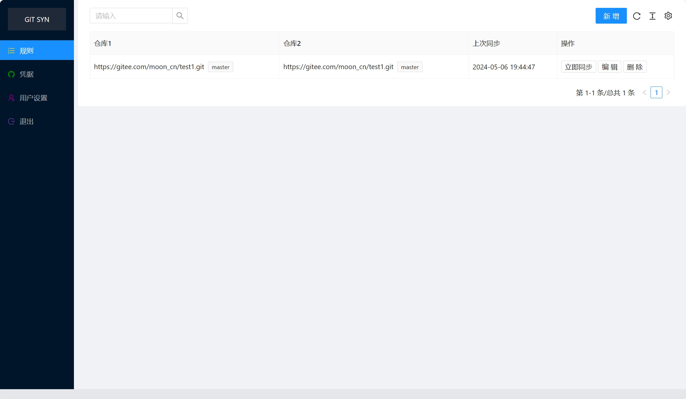
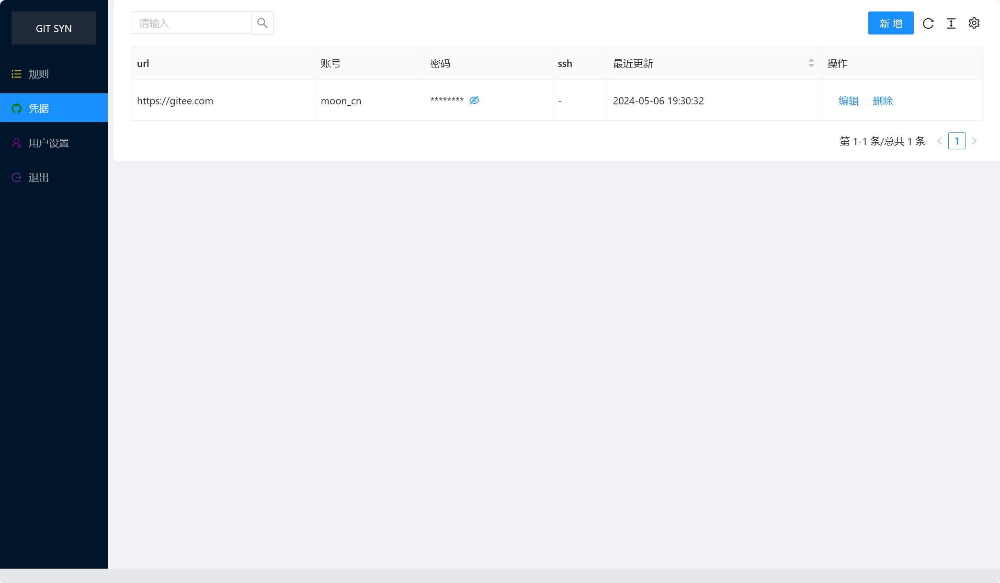

# git-repo-sync
多GIT仓库互相同步


同步git代码仓库, 
遇到冲突则不再同步
每隔5分钟执行一次

# 安装
## 方式一、docker
```
docker run -p:8080:8080 -v /derby-data:/derby-data --name git-repo-sync -d mooncn/git-repo-sync:latest  
```


## 方式二、 java
略

# 使用方式
http://127.0.0.1:8080

默认账号：admin,密码：123456

- 创建仓库凭据

目前只支持账号密码方式。
其中url用来匹配git仓库，可以简单填写域名如https://gitee.com

- 定义同步规则

一个规则包含两个git仓库地址。可点击【立即同步】按钮测试


# 页面截图
## 规则


## 凭据

